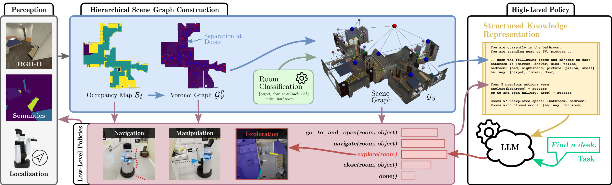

Toyota Motor Europe NV/SA and its affiliates retain all intellectual property and proprietary rights in and to this software, related documentation and any modifications thereto. Any use, reproduction, disclosure or distribution of this software and related documentation without an express license agreement from Toyota Motor Europe NV/SA is strictly prohibited.

# Language-Grounded Dynamic Scene Graphs for Interactive Object Search with Mobile Manipulation
[**arXiv**](https://arxiv.org/abs/2403.08605) | [**website**](http://moma-llm.cs.uni-freiburg.de) 

Repository providing the source code for the paper
>Language-Grounded Dynamic Scene Graphs for Interactive Object Search with Mobile Manipulation  
>[Daniel Honerkamp](https://rl.uni-freiburg.de/people/honerkamp)* [Martin Büchner](https://rl.uni-freiburg.de/people/buechner)*,  [Fabien Despinoy](https://www.toyota-europe.com/about-us/toyota-in-europe/toyota-motor-europe), [Tim Welschehold](https://rl.uni-freiburg.de/people/welschehold) and [Abhinav Valada](https://rl.uni-freiburg.de/people/valada)

  <!--  -->
  

Please cite the paper as follows:

    @article{honerkamp2024language,
        title={Language-Grounded Dynamic Scene Graphs for Interactive Object Search with Mobile Manipulation},
        journal={arXiv preprint},
        author={Daniel Honerkamp and Martin Büchner and Fabien Despinoy and Tim Welschehold and Abhinav Valada},
        year={2024},
    }

## Docker
For simple use, we provide a Dockerfile and Vscode devcontainer configuration. 

This requires [Docker](https://www.docker.com/) and [Vscode](https://code.visualstudio.com/) to be installed, as well as the [NVIDIA Container Toolkit](https://docs.nvidia.com/datacenter/cloud-native/container-toolkit/latest/install-guide.html) for GPU support.
Within vscode, please install the Docker extension. Alternatively, use the same arguments as defined in `devcointainer.json` to build and run the container without vscode.

1. Please add `OPENAI_ORGANIZATION` and `OPENAI_API_KEY` to `devcontainer.json` to use the OpenAI API. Doing so will incur costs! Alternatively, set the `agent` value in `configs/moma_llm.yaml` to `random` or `greedy` to use a baseline that does not use the API.
2. Download data locally and store in [repository root]/data/ (will be mounted into container): https://stanfordvl.github.io/iGibson/dataset.html
3. Open project in vscode. Install the vscode docker extension. Then press `F1` -> `Build and reopen in container` to open the project in docker.
4. Test igibson. If not activated, first activate the conda environment with `source activate igibson`. Then, this should open a window with the camera, robot moving around: `python -m igibson.examples.environments.env_nonint_example`. Note that this requires a display. Make sure that the `DISPLAY` environment variable is defined (usually same value as outside the docker container).
5. On your host system, you might have to run: `xhost +local:root` or `sudo xhost +` otherwise you might observe an error like `qt.qpa.xcb: could not connect to display :0`
6. Download the assets locally (within docker to have the igibson dependencies): run `python -m igibson.utils.assets_utils --download_assets` - this will persist in the mounted directory

This docker image builds up on the iGibson docker image. For more information on how to use iGibson with docker, see: https://stanfordvl.github.io/iGibson/quickstart.html?highlight=docker.

## Local installation
To use without docker, instead 
1. Install iGibson: https://stanfordvl.github.io/iGibson/installation.html
2. Update the conda environment for igibson with the dependencies with `pip3 install -r requirements.txt --extra-index-url https://download.pytorch.org/whl/cu113`
3. Follow the data-download steps from the Docker section above

## Running the approach
The main entry command is `python run_agent.py`. If not activated, first activate the conda environment with `source activate igibson`. The main settings are defined in `configs/moma_llm.yaml`.
